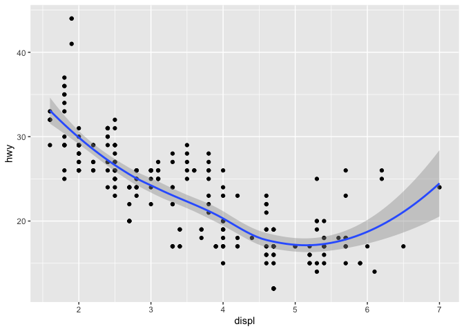

### 3.2

#### Notes

 - data frame is a rectangular collection of variables (in the columns) and observations (in the rows) 
  
 - ggplot(data = <DATA>) + 
  <GEOM_FUNCTION>(mapping = aes(<MAPPINGS>))

#### 3.2.4 Exercises 

1. Run ggplot(data = mpg). What do you see?


```r
library(ggplot2)
ggplot(data = mpg)
```

<!-- -->

There is a blank screen. 

2. How many rows are in mpg? How many columns?


```r
mpg
```

```
## # A tibble: 234 x 11
##    manufacturer model displ  year   cyl trans drv     cty   hwy fl    class
##    <chr>        <chr> <dbl> <int> <int> <chr> <chr> <int> <int> <chr> <chr>
##  1 audi         a4      1.8  1999     4 auto… f        18    29 p     comp…
##  2 audi         a4      1.8  1999     4 manu… f        21    29 p     comp…
##  3 audi         a4      2    2008     4 manu… f        20    31 p     comp…
##  4 audi         a4      2    2008     4 auto… f        21    30 p     comp…
##  5 audi         a4      2.8  1999     6 auto… f        16    26 p     comp…
##  6 audi         a4      2.8  1999     6 manu… f        18    26 p     comp…
##  7 audi         a4      3.1  2008     6 auto… f        18    27 p     comp…
##  8 audi         a4 q…   1.8  1999     4 manu… 4        18    26 p     comp…
##  9 audi         a4 q…   1.8  1999     4 auto… 4        16    25 p     comp…
## 10 audi         a4 q…   2    2008     4 manu… 4        20    28 p     comp…
## # … with 224 more rows
```

There are 11 columns and 234 rows.

3. What does the drv variable describe? Read the help for ?mpg to find out.

The variable drv tells whether or not the car is front wheel drive. 

4. Make a scatterplot of hwy vs cyl.


```r
ggplot(data = mpg) +
  geom_point(mapping = aes (x = hwy, y = cyl))
```

<!-- -->

5. What happens if you make a scatterplot of class vs drv? Why is the plot not useful?


```r
ggplot(data = mpg) +
  geom_point(mapping = aes (x = class, y = drv))
```

<!-- -->

There is no trend in the graph and it is useless becuase both varaibles are categorical. 

### 3.3

#### Notes

 - aesthetic includes size, shape, color of points
 
 - ggplot(data = mpg) + 
  geom_point(mapping = aes(x = displ, y = hwy, **color = class**))
  
 - color can be replaced with size, shape (ggplot2 only uses 6 shapes at a time), alpha, fill

 - to set an aesthetic manually, set the aesthetic by name as an argument of your geom function; i.e. it goes outside of aes()
 
  - the name of the color as a haracter string
  
  - the size of point in mm
  
  - the shape of point as # (these can be found as figure 3.1 in the textbook)
  
#### 3.3.1 Exercises

1. What’s gone wrong with this code? Why are the points not blue?


```r
ggplot(data = mpg) + 
  geom_point(mapping = aes(x = displ, y = hwy, color = "blue"))
```

<!-- -->

The points are not blue because the color is not written outside the aes() function as a seperate argument. 

2. Which variables in mpg are categorical? Which variables are continuous? (Hint: type ?mpg to read the documentation for the dataset). How can you see this information when you run mpg?

Categorical: manufacturer, model, trans, drv, fl, class

Continuous: displ, year, cty, hwy, cyl

3. Map a continuous variable to color, size, and shape. How do these aesthetics behave differently for categorical vs. continuous variables?


```r
ggplot(data = mpg) +
  geom_point(mapping = aes (x = class, y = drv, color = cty))
```

<!-- -->

```r
# ggplot(data = mpg) + geom_point(mapping = aes (x = class, y = drv, shape = cty)) this creates an error 

ggplot(data = mpg) +
  geom_point(mapping = aes (x = class, y = drv, size = cty))
```

<!-- -->

A continuous variable cannot be mapped to shape; a categorical can. 

4. What happens if you map the same variable to multiple aesthetics?


```r
ggplot(data = mpg) + geom_point(mapping = aes (x = class, y = drv, size = trans, color = trans))
```

```
## Warning: Using size for a discrete variable is not advised.
```

<!-- -->

The variable is represented by both aesthetics together. 

5. What does the stroke aesthetic do? What shapes does it work with? (Hint: use ?geom_point)

Stroke controls the width of the border of specific shapes. Only shapes that have a border work with stroke. 

6. What happens if you map an aesthetic to something other than a variable name, like aes(colour = displ < 5)? Note, you’ll also need to specify x and y.


```r
ggplot(data = mpg) + geom_point(mapping = aes (x = class, y = drv, color = displ < 5))
```

<!-- -->

ggplot turns the statement into a boolean variable and maps true or false for the color argument. 

### 3.5 

#### Notes 

 - facets are subplots that each display one subset of data
 
 - ggplot(data = mpg) + geom_point(mapping = aes(x = displ, y = hwy)) +  facet_wrap(~ variable name, nrow = 2)
 
 - to facet your plot on the combination of two variables, add facet_grid()
 
 - ggplot(data = mpg) + geom_point(mapping = aes(x = displ, y = hwy)) + facet_grid(drv ~ cyl)
 
 - to not facet in the rows or columns dimension, use a . instead of a variable name, ex. + facet_grid(. ~ cyl)
 
#### 3.5.1 Exercises

1. What happens if you facet on a continuous variable?


```r
ggplot(data = mpg) +
geom_point(mapping = aes(x = displ, y = hwy)) +
facet_wrap(~cty)
```

<!-- -->

It plots it. 

2. What do the empty cells in plot with facet_grid(drv ~ cyl) mean? How do they relate to this plot?


```r
ggplot(data = mpg) + geom_point(mapping = aes(x = displ, y = hwy)) + facet_wrap(drv ~ cyl)
```

<!-- -->

It means there are no data points for certain combinations. 

3. What plots does the following code make? What does . do?


```r
ggplot(data = mpg) + 
  geom_point(mapping = aes(x = displ, y = hwy)) +
  facet_grid(drv ~ .)
```

<!-- -->

```r
ggplot(data = mpg) + 
  geom_point(mapping = aes(x = displ, y = hwy)) +
  facet_grid(. ~ cyl)
```

<!-- -->

The . determines whether the facets will be veritcal or horizontal. 

4. Take the first faceted plot in this section:


```r
ggplot(data = mpg) + 
  geom_point(mapping = aes(x = displ, y = hwy)) + 
  facet_wrap(~ class, nrow = 2)
```

<!-- -->

What are the advantages to using faceting instead of the colour aesthetic? What are the disadvantages? How might the balance change if you had a larger dataset?

Using facets is better when you want to pay attention to particular groups while color is better when you want to see where a point is located in relation to all the data. Facetting also helps when you want to look at specific group patterns or trends and is easier to use when there dataset is large. 

5. Read ?facet_wrap. What does nrow do? What does ncol do? What other options control the layout of the individual panels? Why doesn’t facet_grid() have nrow and ncol arguments?

Nrow determines how many rows of facets you want while ncol determines how many columns of facets you want. Some other control options include labeller to control how labels are printed and strip. position to display labels at the side or bottom. facet_grid() doesn;t have nrow or ncol becuase it autimatically calculates the grid based on the number of values in the variables. 

6. When using facet_grid() you should usually put the variable with more unique levels in the columns. Why?

If you don't put the more unique variable in the the columns, then the graph will be too long and it will be hard to understand anything. 

### 3.6

#### Notes

 - geom = visual object
 - to change the geom, use the geom_function, but change function to the kind of graph you wnat; ex. geom_smooth will give you a smooth line
 - every geom takes a mapping argument, but not all aesthetics
 - set linetype of a function instead of shape to change the kind of line used 
 - to display multiple geoms on a graph, use muliplte geom functions in the ggplot():
 
ggplot(data = mpg, mapping = aes(x = displ, y = hwy)) + 
  geom_point() + 
  geom_smooth()

 - if you want to specify certain aesthetics to a specific geom, then add it to that geom's function only and it will override the global ggplot function 

#### 3.6.1 Exercises

1. What geom would you use to draw a line chart? A boxplot? A histogram? An area chart?

**Linechart**: geom_line()
**Boxplot**: geom_boxplot()
**Histogram**: geom_histogram()
**Area chart**: geom_are()

2. Run this code in your head and predict what the output will look like. Then, run the code in R and check your predictions.

ggplot(data = mpg, mapping = aes(x = displ, y = hwy, color = drv)) + 
  geom_point() + 
  geom_smooth(se = FALSE)

3. What does show.legend = FALSE do? What happens if you remove it?
Why do you think I used it earlier in the chapter?

It removes the lengend. The plot looks cleaner when it is clear that the grouping is based on a specifi variable. 

4. What does the se argument to geom_smooth() do?

It removes the confidence intervals. 

5. Will these two graphs look different? Why/why not?


```r
ggplot(data = mpg, mapping = aes(x = displ, y = hwy)) + 
  geom_point() + 
  geom_smooth()
```

```
## `geom_smooth()` using method = 'loess' and formula 'y ~ x'
```

<!-- -->

```r
ggplot() + 
  geom_point(data = mpg, mapping = aes(x = displ, y = hwy)) + 
  geom_smooth(data = mpg, mapping = aes(x = displ, y = hwy))
```

```
## `geom_smooth()` using method = 'loess' and formula 'y ~ x'
```

<!-- -->

They look the same because they are both commanding the same thing. In the first graph, the code is written universally for both geoms while in the second graph, the entire code is written out for
both geoms. 

6. Recreate the R code necessary to generate the following graphs. (I did the first and third graph.)


```r
ggplot(data = mpg, mapping = aes(x = displ, y = hwy)) +
  geom_point() +
  geom_smooth()
```

```
## `geom_smooth()` using method = 'loess' and formula 'y ~ x'
```

<!-- -->

```r
ggplot(data = mpg, mapping = aes(x = displ, y = hwy, color = drv)) +
  geom_point() +
  geom_smooth()
```

```
## `geom_smooth()` using method = 'loess' and formula 'y ~ x'
```

<!-- -->

### 3.10

#### Notes

 - ggplot(data = <DATA>) + 
  <GEOM_FUNCTION>(
     mapping = aes(<MAPPINGS>),
     stat = <STAT>, 
     position = <POSITION>
  ) +
  <COORDINATE_FUNCTION> +
  <FACET_FUNCTION>
  - In order to turn any dataset into a plot:
  1. Use stat_count() to transform dataset into only the variables you want to see
  2. Assign aesthetic properties to each variable (each value of a variable would represent a diff level of the aesthetic).
  3. Assign varible to x and y (basically step 2).
  4. Further adjust the graph using additional layers; ex, facets, position adjustments, etc. 
  
