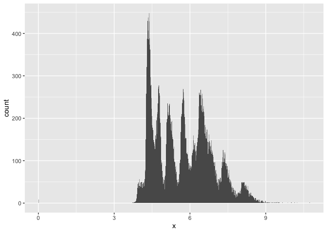
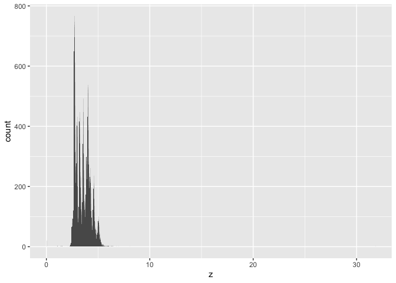
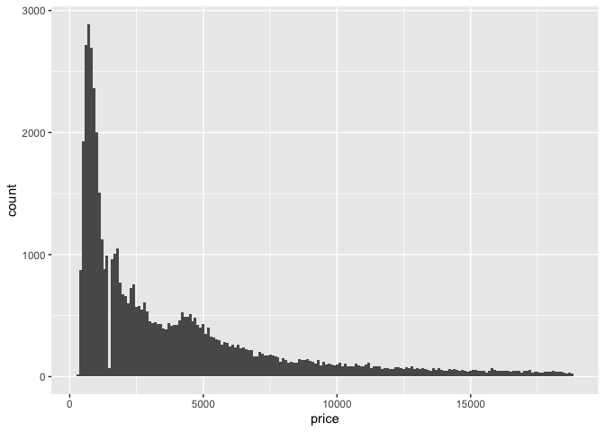
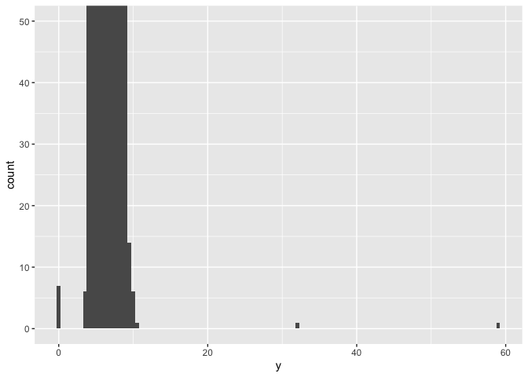
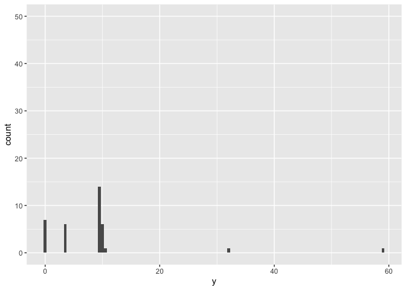
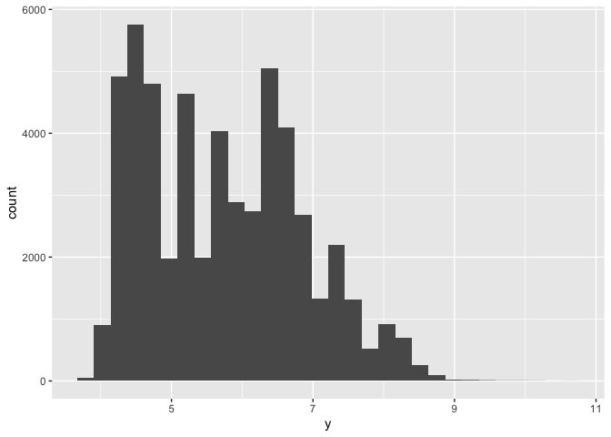
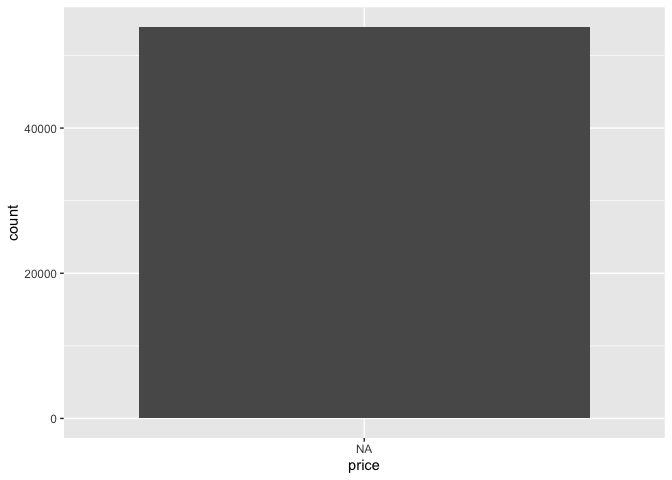
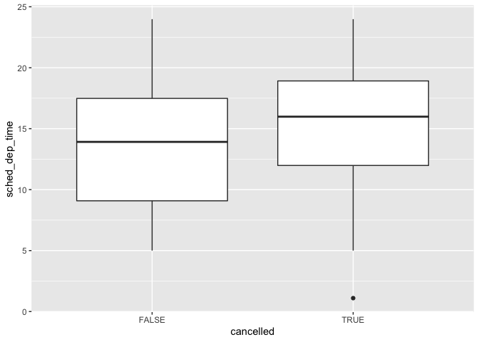
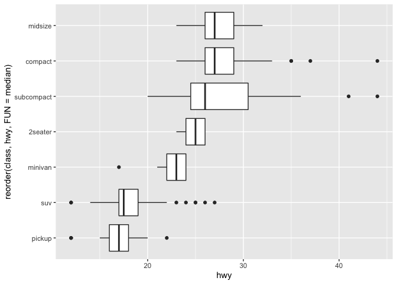
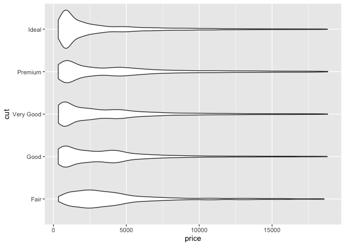

### Chapter 7

#### 7.3 

##### Notes 

- tabular data is a set of values, variable and an observation. tidy if each value is placed in its own “cell”, each variable in its own column, and each observation in its own row.

- Variation is the tendency of the values of a variable to change from measurement to measurement. 

- measure any continuous variable twice, you will get two different results

- variable is categorical if it can only take one of a small set of values -> use bar chart to examine 

- compute values manually with dplyr::count()

- continuous if it can take any of an infinite set of ordered values -> use histogram

- binwidth = and cut_width(), which is only used in the dplyr :: count, sets the increments in which you want your varaible counted

- overly multiple histograms/variables, use geom_freqploy()

- to see rare bins and zoom in on unusual values, use coord_cortesian(ylim=) 

##### 7.3.4 Exercises

1. Explore the distribution of each of the x, y, and z variables in diamonds. What do you learn? Think about a diamond and how you might decide which dimension is the length, width, and depth.


```r
library(tidyverse)
```

```
## ── Attaching packages ──────────────────────────────────────────────────── tidyverse 1.2.1 ──
```

```
## ✔ ggplot2 3.2.1     ✔ purrr   0.3.2
## ✔ tibble  2.1.3     ✔ dplyr   0.8.3
## ✔ tidyr   0.8.3     ✔ stringr 1.4.0
## ✔ readr   1.3.1     ✔ forcats 0.4.0
```

```
## ── Conflicts ─────────────────────────────────────────────────────── tidyverse_conflicts() ──
## ✖ dplyr::filter() masks stats::filter()
## ✖ dplyr::lag()    masks stats::lag()
```

```r
library(ggplot2)
summary(select(diamonds,x,y,z))
```

```
##        x                y                z         
##  Min.   : 0.000   Min.   : 0.000   Min.   : 0.000  
##  1st Qu.: 4.710   1st Qu.: 4.720   1st Qu.: 2.910  
##  Median : 5.700   Median : 5.710   Median : 3.530  
##  Mean   : 5.731   Mean   : 5.735   Mean   : 3.539  
##  3rd Qu.: 6.540   3rd Qu.: 6.540   3rd Qu.: 4.040  
##  Max.   :10.740   Max.   :58.900   Max.   :31.800
```

```r
ggplot(diamonds)+
  geom_histogram(mapping = aes(x = x),binwidth = 0.01)
```

<!-- -->

```r
ggplot(diamonds)+
  geom_histogram(mapping = aes(x = y),binwidth = 0.01)
```

<!-- -->

```r
ggplot(diamonds)+
  geom_histogram(mapping = aes(x = z),binwidth = 0.01)
```

<!-- -->
The x and y variables are almost two times bigger than z. All three numbers also have outliers as both the max and min are abnormal numbers. The outlier values don't mathmatically match with the rest of the variables, therefore they must be miscalculations. In order to determine which variable is what dimension, I predict that the x value is length, since it has to be smaller than the width, which is the y value because it has the greatest value. The third variable is depth, which has to be smaller than both length and width, so it is the z variable. 

2. Explore the distribution of price. Do you discover anything unusual or surprising? (Hint: Carefully think about the binwidth and make sure you try a wide range of values.)


```r
ggplot(diamonds) +
  geom_histogram(mapping = aes(x = price), binwidth = 100)
```

<!-- -->

```r
ggplot(filter(diamonds, price < 2500), aes(x = price)) +
  geom_histogram(binwidth = 10, center = 0)
```

<!-- -->

There are no diamonds sold around $1500 and there is a spike around $750.

3. How many diamonds are 0.99 carat? How many are 1 carat? What do you think is the cause of the difference?


```r
filter(diamonds, carat >= 0.99, carat <= 1) %>%
  count(carat)
```

```
## # A tibble: 2 x 2
##   carat     n
##   <dbl> <int>
## 1  0.99    23
## 2  1     1558
```
There are almost 70 times the amount of 1 carat diamonds there are than 0.99 carat. This could be due to the fact that with this 0.01 carat, increase the price also increases significantlly. 

4. Compare and contrast coord_cartesian() vs xlim() or ylim() when zooming in on a histogram. What happens if you leave binwidth unset? What happens if you try and zoom so only half a bar shows?


```r
ggplot(diamonds) + 
  geom_histogram(mapping = aes(x = y), binwidth = 0.5) +
  coord_cartesian(ylim = c(0, 50))
```

<!-- -->

```r
ggplot(diamonds) + 
  geom_histogram(mapping = aes(x = y), binwidth = 0.5) +
  ylim (0, 50)
```

```
## Warning: Removed 11 rows containing missing values (geom_bar).
```

<!-- -->
When using coord_cartesian, it zooms in and when using ylim it removes the values that exceed the limit and makes a graph with the remaining values. 


```r
ggplot(diamonds) + 
  geom_histogram(mapping = aes(x = y))
```

```
## `stat_bin()` using `bins = 30`. Pick better value with `binwidth`.
```

<!-- -->
If you do not set a banwidth it will set its own by deafult. 

#### 7.4

##### Notes

 - to remove strange values you can drop the entire row by using filter(between())

 - don't do first option, do second, which is mutate(ifelse(the logical vector of values u want to remove, what u want to be if the vecotor is ture which is usually NA, what you want if the vector is false which is the variable you started with))
 
 - na.rm = TRUE surpresses warning that values have been removed 
 
##### 7.4.1 Exercises

1. What happens to missing values in a histogram? What happens to missing values in a bar chart? Why is there a difference?


```r
bad <- mutate(diamonds, y = ifelse(y < 3 | y > 20, NA, y))
ggplot(bad, aes(x = y)) + 
 geom_histogram()
```

```
## `stat_bin()` using `bins = 30`. Pick better value with `binwidth`.
```

```
## Warning: Removed 9 rows containing non-finite values (stat_bin).
```

<!-- -->
When using a histogram, you get a warning message that it is removing rows. 


```r
diamonds2 <- mutate(diamonds, price = ifelse(price > 1450 | price < 1750, NA, price))
ggplot(diamonds2, aes(x = price)) +
  geom_bar()
```

<!-- -->
In geom_bar, if the variable is discrete, then there can be a bar for NA values. 

#### 7.5

##### Notes 

 - covariation is the tendency for the values of two or more variables to vary together in a related way

 - common to want to explore the distribution of a continuous variable broken down by a categorical variable

 - geom_freqpoly() is not useful for that comparison because height given by the count. if one of the groups smaller than the others, hard to see the differences in shape.

 - swap what is displayed on the y-axis to make easier. for ex. density = count standardised so area under each freq polygon is 1

 - boxplot also good for comparisn
 
 - use reorder() to reorder categorical variables 
 
 - coor_flip() to fip graph 90 degrees
 
 - to visualise the covariation between categorical variables, count the number of observations for each combination -> use geom_count()
  - then visualise with geom_tile() and the fill aesthetic: geom_tile(mapping = aes(fill = n))

 - covariation between two continuous variables: draw a scatterplot with geom_point()
  - if dataset is too large, use bins
  - bins in 1 dimension: geom_frepoly, geom_histogram
  - bins in 2 dimensions: geom_bin2d() and geom_hex()
  - or j treat one variable as categorical and use geom_boxplot()

##### 7.5.1 Exercises

1. Use what you’ve learned to improve the visualisation of the departure times of cancelled vs. non-cancelled flights.


```r
nycflights13::flights %>%
  mutate(cancelled = is.na(dep_time), sched_hour = sched_dep_time %/% 100, sched_min = sched_dep_time %% 100, sched_dep_time = sched_hour + sched_min / 60) %>%
  ggplot() +
  geom_boxplot(mapping = aes(x = cancelled, y = sched_dep_time))
```

<!-- -->

2. What variable in the diamonds dataset is most important for predicting the price of a diamond? How is that variable correlated with cut? Why does the combination of those two relationships lead to lower quality diamonds being more expensive?


```r
ggplot(diamonds, mapping = aes(x = carat, y = price)) +
  geom_boxplot(mapping = aes(group = cut_width (carat, 0.1)))
```

<!-- -->
Carat is the most important in predicting the price of a diamond becuase it has the most variation when being compared with price, while other variables have more variation within its categories. 

```{}
ggplot(diamonds, mapping = aes(x = cut, y = carat)) +
  geom_boxplot()
```

The largest carated diamonds have a cut of fair, which is the lowest, which means there is a negative relationship between carat and cut. Smaller diamonds are probably best cut becuase they are so expensive and larger are diamonds are a worse cut becuase the most profit can be made off of them.

3. Install the ggstance package, and create a horizontal boxplot. How does this compare to using coord_flip()?


```r
library(ggstance)
```

```
## 
## Attaching package: 'ggstance'
```

```
## The following objects are masked from 'package:ggplot2':
## 
##     geom_errorbarh, GeomErrorbarh
```

```r
ggplot(mpg) +
  geom_boxploth(mapping = aes(x = hwy, y = reorder(class, hwy, FUN = median)))
```

<!-- -->

It looks the same as the coord_flip that was used earlier in the chapter to flip this data 90 degrees.

5.Compare and contrast geom_violin() with a facetted geom_histogram(), or a coloured geom_freqpoly(). What are the pros and cons of each method? 


```r
ggplot(diamonds, mapping = aes(x = cut, y = price)) +
  geom_violin() +
  coord_flip()
```

<!-- -->

```r
ggplot(data = diamonds, mapping = aes(x = price, y = ..density..)) +
  geom_freqpoly(mapping = aes(color = cut), binwidth = 500)
```

<!-- -->
With geom_violin you can only visualize with two variables, but it is grouped by categories so you can see the data of each category of one variable in relation to another variable. With geom_fregpoly, three variables are used so you can see clearly see which category has the highest values compared to other categories, but you can't see each individual category of the variable and its values.

6. If you have a small dataset, it’s sometimes useful to use geom_jitter() to see the relationship between a continuous and categorical variable. The ggbeeswarm package provides a number of methods similar to geom_jitter(). List them and briefly describe what each one does.

 - geom_quasirandom() produces plots that are a mix of jitter and violin plots.

 - geom_beeswarm() produces a plot similar to a violin plot, but by offsetting the points.
 
 **- how do residuals work in 7.6??**
 
 - when moving from data to plot, can use pipe, but when using ggplot2, can't use pipe, have to use + 
 
 - argument of aes(x, y)
 
 - argument of ggplot(data, mapping)
 
##### 7.5.2-7.5.3

Describe an experiment that would fall into each of these categories (two categorical variables and two continuous variables). 

An experiment with two categorical variables would be recording the n of leaves different types of tomato plants have at 2 wks. An experiment with two continous varaibles would be testing how height of a tomato plant responds to an increased salinity in water for 2 wks.   

### Chapter 8

#### Notes

 - consider R scripts "real"
 
 - easy to make an environment from R scripts, but not vice versa 
 
 -  to make sure you’ve captured the important parts of your code in the editor:
    - Press Cmd/Ctrl + Shift + F10 to restart RStudio.
    - Press Cmd/Ctrl + Shift + S to rerun the current script.

-  two basic styles of paths: Mac/Linux and Windows 
  -  Mac and Linux uses slashes and Windows uses backslashes
  - to get a single backslash in the path, you need to type two backslashes
  - Absolute paths (i.e. paths that point to the same place regardless of your working directory) look different. In Windows they start with a drive letter or two backslashes and in Mac/Linux they start with a slash “/” 
  - avoid working in absolute paths 
  - ~ is a convenient shortcut to your home directory in Mac/Linux
  
 - Create an RStudio project for each data analysis project.

 - Keep data files there; we’ll talk about loading them into R in data import.

 - Keep scripts there; edit them, run them in bits or as a whole.

 - Save your outputs (plots and cleaned data) there.

 - Only ever use relative paths, not absolute paths.
