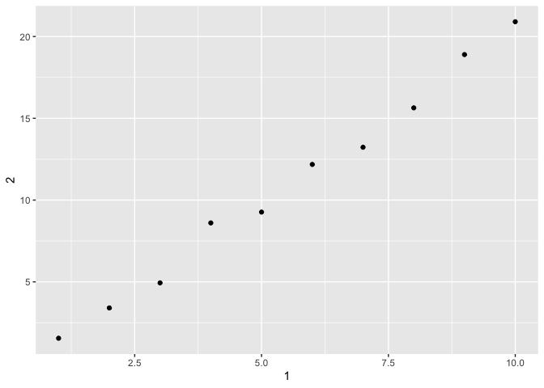

### Chapter 10

#### Notes
 - coerce data frame to become tibble by using as.tibble()
 
 - create a new tibble from individual vectors with tibble()
 
 - tibble it never changes the type of the inputs (e.g. it never converts strings to factors!), it never changes the names of variables, and it never creates row names
 
 -  non-syntactic names -> use backticks `` (used in ggplot2 and dplyr)
 
 - tribble() is customised for data entry in code: column headings are defined by formulas (i.e. they start with ~), and entries are separated by commas
 
 - tibbles shows only the first 10 rows, and all the columns that fit on screen and reports its type using str() -> good when working w alot of data
 
 - if you want all data, print() the data frame and control the number of rows (n) and the width of the display. width = Inf display all columns
 
 - use view() to see all data
 
 - want to pull out a single variable use $ and [[. [[ can extract by name or position; $ extracts by name
 
 - use in a pipe, need to use the special placeholder . (ex. tibble name %>% .$x)
 
 - if older function, use class(as.data.frame()) to turn a tibble back to a data.frame
 
 - flat files into data frames
    - read_csv(): reads comma delimited files
    - read_csv2(): reads semicolon separated files
    - read_tsv(): reads tab delimited files
    - read_delim(): reads in files with any delimiter
    - read_fwf(): reads fixed width files
    - fwf_widths(): specify fields by their width
    - fwf_positions(): specify fields by their position
    - read_table(): reads a common variation of fixed width files where columns are separated by white space
    - read_log(): reads Apache style log files
 
 - read_csv() uses first line of the data for the column names
  - if you don't want that
    - metadata at the top of the file (Use skip = n to skip the first n lines or use comment = "#" to drop all lines that start with #)
    - the data doesn't have col names, use col_names=FALSE
    - col_names a character vector which will be used as the column names
  
 - n/ will allow you to insert another value into the row 
 
 - parse_*() functions take a character vector and return a more specialised vector like a logical, integer, or date
  -  the first argument is a character vector to parse, and the na argument specifies which strings should be treated as missing
  - many parsing failures, you’ll need to use problems() to get the complete set
  
 - eight particularly important parsers:
  - parse_logical() and parse_integer() parse logicals and integers 
  - parse_double() is a strict numeric parser, and parse_number() is a flexible numeric parser
    - use locale = locale(decimal_mark = "," to override the standard decimal mark . 
  - parse_number() ignores non-numeric characters before and after the number
    - to change the grouping mark, which is , by default use locale = locale(grouping_mark = "whatver grouping mark u want to use"
  - parse_character()
    - underlying representation of a string using charToRaw()
    - data produced by older systems that don’t understand UTF-8 will producde gibberish
    - to fix this, use locale = locale(encoding = "")
    - use guess_encoding() to help you figure what encoding used
  - parse_factor() create factors, the data structure that R uses to represent categorical variables 
    - give parse_factor() a vector of known levels to generate a warning whenever an unexpected value is present
  - parse_datetime(), parse_date(), and parse_time() allow you to parse various date & time 
    - date (the number of days since 1970-01-01)
      - expects a four digit year, a - or /, the month, a - or /, then the day
    - a date-time (the number of seconds since midnight 1970-01-01)
      - expects an ISO8601 date-time which the components of a date are organised from biggest to smallest: year, month, day, hour, minute, second.
    - or a time (the number of seconds since midnight)
      - expects the hour, :, minutes, optionally : and seconds, and an optional am/pm specifier
      - use hms package, if it doesn't work create your own date-time format
 - how readr figures out type of each column: guess_parser(), which returns readr’s best guess, and parse_guess() which uses that guess to parse the column
 
 -  easier to diagnose problems if you just read in all the columns as character vectors -> challenge2 <- read_csv(readr_example("challenge.csv"), 
  col_types = cols(.default = col_character()))
  
 - type_convert() applies the parsing heuristics to the character columns in a data frame
 
- having major parsing problems,  read into a character vector of lines with read_lines(), or even a character vector of length 1 with read_file()

 - large file? set n_max = 
 
 - write_csv() and write_tsv() write data back to disk 
  - always encoding strings in UTF-8.
  - saving dates and date-times in ISO8601 format so they are easily parsed elsewhere
  - want to export a csv file to Excel, use write_excel_csv()
  - most important arguments are x (the data frame to save), and path (the location to save it)
  - want to keep coulmn type after using write_csv(), then use these in place of  write_csv() and read_csv()
   1. write_rds() and read_rds() are uniform wrappers around the base functions readRDS() and saveRDS() 
   2. the feather package 
   
 - To get other types of data into R:
  - rectangular data:
   - haven reads SPSS, Stata, and SAS files
   - readxl reads excel files (both .xls and .xlsx)
   - DBI, along with a database specific backend (e.g. RMySQL, RSQLite, RPostgreSQL etc) allows you to run SQL queries against a database and return a data frame 
  - hierarchical data
   - jsonlite for json
   - xml2 for XML
  - for other data, try rio package
   
#### 10.5.4 Problems
1. How can you tell if an object is a tibble?

A tibble only displays the first 10 rows and under each row reports its type under the name. 

2. Compare and contrast the following operations on a data.frame and equivalent tibble. What is different? Why might the default data frame behaviours cause you frustration?


```r
library(tidyverse)
```

```
## ── Attaching packages ──────────────────────────────────────────── tidyverse 1.2.1 ──
```

```
## ✔ ggplot2 3.2.1     ✔ purrr   0.3.2
## ✔ tibble  2.1.3     ✔ dplyr   0.8.3
## ✔ tidyr   0.8.3     ✔ stringr 1.4.0
## ✔ readr   1.3.1     ✔ forcats 0.4.0
```

```
## ── Conflicts ─────────────────────────────────────────────── tidyverse_conflicts() ──
## ✖ dplyr::filter() masks stats::filter()
## ✖ dplyr::lag()    masks stats::lag()
```

```r
df <- data.frame(abc = 1, xyz = "a")
df$x
```

```
## [1] a
## Levels: a
```

```r
df[, "xyz"]
```

```
## [1] a
## Levels: a
```

```r
df[, c("abc", "xyz")]
```

```
##   abc xyz
## 1   1   a
```

```r
tbl <- as_tibble(df)
tbl$x
```

```
## Warning: Unknown or uninitialised column: 'x'.
```

```
## NULL
```

```r
tbl[, "xyz"]
```

```
## # A tibble: 1 x 1
##   xyz  
##   <fct>
## 1 a
```

```r
tbl[, c("abc", "xyz")]
```

```
## # A tibble: 1 x 2
##     abc xyz  
##   <dbl> <fct>
## 1     1 a
```
When working with default data frames, the $ will match any column name that starts with the name following it. This could be a problem becuase there could be multiple columns starting with the same name and one could forget that and accidently use a different coulmn then what they were thinking. The [ operator depends on the number of columns there are. If there is one column, it will return a vector and not a data frame. If you aren't aware of the length and use [, then it could result in bugs in your code. 

4. Practice referring to non-syntactic names in the following data frame by:
 1. Extracting the variable called 1.
 2. Plotting a scatterplot of 1 vs 2.
 3. Creating a new column called 3 which is 2 divided by 1.
 4. Renaming the columns to one, two and three.

```r
library(ggplot2)
annoying <- tibble(
  `1` = 1:10,
  `2` = `1` * 2 + rnorm(length(`1`))
)
annoying[["1"]]
```

```
##  [1]  1  2  3  4  5  6  7  8  9 10
```

```r
ggplot(annoying, aes(x = `1`, y = `2`)) +
  geom_point()
```

<!-- -->

```r
annoying <- mutate(annoying, `3` = `2`/`1`)
annoying <- rename(annoying, one = `1`, two = `2`, three = `3`)
annoying
```

```
## # A tibble: 10 x 3
##      one   two three
##    <int> <dbl> <dbl>
##  1     1  1.55  1.55
##  2     2  3.41  1.70
##  3     3  4.94  1.65
##  4     4  8.60  2.15
##  5     5  9.27  1.85
##  6     6 12.2   2.03
##  7     7 13.2   1.89
##  8     8 15.6   1.95
##  9     9 18.9   2.10
## 10    10 20.9   2.09
```

5. What does tibble::enframe() do? When might you use it?

Tibble::enframe converts named atomic vectors or lists to one- or two-column data frames. You can use it to organize your data. 

### Chapter 11

#### Notes
 - use read_csv()

#### 11.2.2 Problems 
1. What function would you use to read a file where fields were separated with
“|”?

You would use read_delim(). 

4. What arguments do you need to specify to read the following text into a data frame? You need to use read_delim() if your CSV file contains commas. Surround commas with quoting characters. read_csv() assumes you will use ". 
"x,y\n1,'a,b'"


```r
library(readr)
x <- "x,y\n1,'a,b'"
read_delim(x, ",", quote = "'")
```

```
## # A tibble: 1 x 2
##       x y    
##   <dbl> <chr>
## 1     1 a,b
```
5. Identify what is wrong with each of the following inline CSV files. What happens when you run the code?

```r
read_csv("a,b,c,\n1,2,3\n4,5,6")
```

```
## Warning: Missing column names filled in: 'X4' [4]
```

```
## Warning: 2 parsing failures.
## row col  expected    actual         file
##   1  -- 4 columns 3 columns literal data
##   2  -- 4 columns 3 columns literal data
```

```
## # A tibble: 2 x 4
##       a     b     c X4   
##   <dbl> <dbl> <dbl> <chr>
## 1     1     2     3 <NA> 
## 2     4     5     6 <NA>
```
Missing a column. If you run code, then since there is a column missing, it drops the data for the last column. 

```r
read_csv("a,b,c\n1,2\n3,1,2,3")
```

```
## Warning: 2 parsing failures.
## row col  expected    actual         file
##   1  -- 3 columns 2 columns literal data
##   2  -- 3 columns 4 columns literal data
```

```
## # A tibble: 2 x 3
##       a     b     c
##   <dbl> <dbl> <dbl>
## 1     1     2    NA
## 2     3     1     2
```
There are more columns in the data then there are in specified in the header. Row one only has two values, so the third becomes NA. Row two has an extra value so the last value is dropped. TO fix it, I just fixed the numbers. 

```r
read_csv("a,b\n\"1")
```

```
## Warning: 2 parsing failures.
## row col                     expected    actual         file
##   1  a  closing quote at end of file           literal data
##   1  -- 2 columns                    1 columns literal data
```

```
## # A tibble: 1 x 2
##       a b    
##   <dbl> <chr>
## 1     1 <NA>
```
I'm not sure what they want to do here, but since "1 was never closed, 1 is treated as an integer so a is too. The second value is NA becuase there is no second value. 

```r
read_csv("a,b\n1,2\na,b")
```

```
## # A tibble: 2 x 2
##   a     b    
##   <chr> <chr>
## 1 1     2    
## 2 a     b
```
Both a and b columns are treated as character becuase they contain non-numeric strings.

```r
read_csv2("a;b\n1;3")
```

```
## Using ',' as decimal and '.' as grouping mark. Use read_delim() for more control.
```

```
## # A tibble: 1 x 2
##       a     b
##   <dbl> <dbl>
## 1     1     3
```
The values are seperated by ; making it all one column and row. use read_csv2()

#### 11.3.5 Problems
1. What are the most important arguments to locale()?
decimal_mark, grouping_mark and encoding. 

2. What happens if you try and set decimal_mark and grouping_mark to the same character? What happens to the default value of grouping_mark when you set decimal_mark to “,”? What happens to the default value of decimal_mark when you set the grouping_mark to “.”?

If the decimal and grouping mark are the same, locale throws and error. 


```r
locale(decimal_mark = ",")
```

```
## <locale>
## Numbers:  123.456,78
## Formats:  %AD / %AT
## Timezone: UTC
## Encoding: UTF-8
## <date_names>
## Days:   Sunday (Sun), Monday (Mon), Tuesday (Tue), Wednesday (Wed),
##         Thursday (Thu), Friday (Fri), Saturday (Sat)
## Months: January (Jan), February (Feb), March (Mar), April (Apr), May
##         (May), June (Jun), July (Jul), August (Aug), September
##         (Sep), October (Oct), November (Nov), December (Dec)
## AM/PM:  AM/PM
```

```r
locale(grouping_mark = ".")
```

```
## <locale>
## Numbers:  123.456,78
## Formats:  %AD / %AT
## Timezone: UTC
## Encoding: UTF-8
## <date_names>
## Days:   Sunday (Sun), Monday (Mon), Tuesday (Tue), Wednesday (Wed),
##         Thursday (Thu), Friday (Fri), Saturday (Sat)
## Months: January (Jan), February (Feb), March (Mar), April (Apr), May
##         (May), June (Jun), July (Jul), August (Aug), September
##         (Sep), October (Oct), November (Nov), December (Dec)
## AM/PM:  AM/PM
```
If the decimal mark is set to "," then the grouping mark is set to "." and vice versa. 

3. I didn’t discuss the date_format and time_format options to locale(). What do they do? Construct an example that shows when they might be useful.
They format date and times using standard POSIX specification and time zone. 

```r
parse_date("1 janvier 2015", "%d %B %Y", locale = locale("fr"))
```

```
## [1] "2015-01-01"
```

7. Generate the correct format string to parse each of the following dates and times:


```r
d1 <- "January 1, 2010"
d2 <- "2015-Mar-07"
d3 <- "06-Jun-2017"
d4 <- c("August 19 (2015)", "July 1 (2015)")
d5 <- "12/30/14" # Dec 30, 2014
t1 <- "1705"
t2 <- "11:15:10.12 PM"

parse_date(d1, "%B %d, %Y")
```

```
## [1] "2010-01-01"
```

```r
parse_date(d2, "%Y-%b-%d")
```

```
## [1] "2015-03-07"
```

```r
parse_date(d3, "%d-%b-%Y")
```

```
## [1] "2017-06-06"
```

```r
parse_date(d4, "%B %d (%Y)")
```

```
## [1] "2015-08-19" "2015-07-01"
```

```r
parse_date(d5, "%m/%d/%y")
```

```
## [1] "2014-12-30"
```

```r
parse_date(t1, "%Y")
```

```
## [1] "1705-01-01"
```

```r
parse_time(t2, "%H:%M:%OS %p")
```

```
## 23:15:10.12
```


