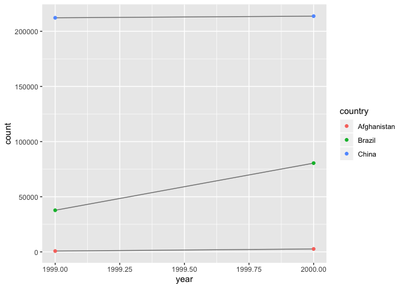
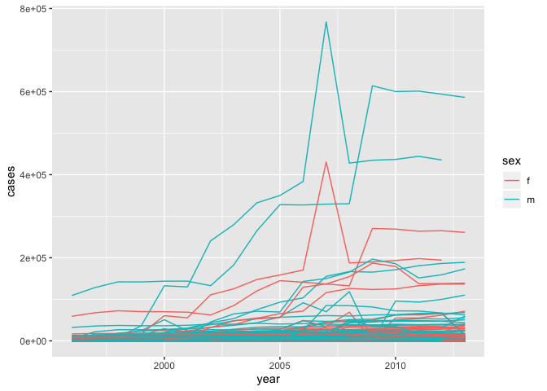

### Chapter 12 

```r
library(tidyverse)
```

```
## ── Attaching packages ──────────────────────────────────────────────────── tidyverse 1.2.1 ──
```

```
## ✔ ggplot2 3.2.1     ✔ purrr   0.3.2
## ✔ tibble  2.1.3     ✔ dplyr   0.8.3
## ✔ tidyr   0.8.3     ✔ stringr 1.4.0
## ✔ readr   1.3.1     ✔ forcats 0.4.0
```

```
## ── Conflicts ─────────────────────────────────────────────────────── tidyverse_conflicts() ──
## ✖ dplyr::filter() masks stats::filter()
## ✖ dplyr::lag()    masks stats::lag()
```

#### Notes
 - There are three interrelated rules which make a dataset tidy:
  1. Each variable must have its own column.
  2. Each observation must have its own row.
  3. Each value must have its own cell.
  
 - Instuctions: 
  1. Put each dataset in a tibble.
  2. Put each variable in a column.
  
 - use gather() and spread() if:
  1. One variable might be spread across multiple columns.
  2. One observation might be scattered across multiple rows.
  
 - to gather columns into a new pair of variables we need three parameters:
  - the set of columns that represent values, not variables. 
  - the name of the variable whose values form the column names. I call that the key
  - the name of the variable whose values are spread over the cells. I call that value 
  - for example: 
   table4a %>% 
    gather(`1999`, `2000`, key = "year", value = "cases")

 - use left_join() to join two tables together
 
 - spread only need two parameters:
  1. The column that contains variable names, the key column. 
  2. The column that contains values from multiple variables, the value column. 
  
 - gather() makes wide tables narrower and longer; spread() makes long tables shorter and wider.
 
 - separate() pulls apart one column into multiple columns, by splitting wherever a separator character appears
  - separate() takes the name of the column to separate, and the names of the columns to separate into
  - by default, separate() will split values wherever it sees a non-alphanumeric character
  - wish to use a specific character to separate a column, you can pass the character to the sep argument of separate()
  - separate() to try and convert to better column types using convert = TRUE
  - can pass a vector of integers to sep. separate() will interpret the integers as positions to split at. + values start at 1 on the far-left of the strings; - value start at -1 on the far-right of the strings.
 
 - unite() combines multiple columns into a single column
  - unite() takes a data frame, the name of the new variable to create, and a set of columns to combine
  - default will place an underscore (_) between the values from different columns. don’t want any separator use ""

 - a value can be missing in one of two possible ways:
  - Explicitly, i.e. flagged with NA.
  - Implicitly, i.e. simply not present in the data.
  
 - set na.rm = TRUE in gather() to turn explicit missing values implicit
 
 - making missing values explicit in tidy data -> use complete()
 
 - when a data source has primarily been used for data entry, missing values indicate that the previous value should be carried forward -> use fill() to fill missing values with most recent not missing values

 - non-tidy 2 tidy in r:
  1. gather together the columns that are not variables 
   - the next thing is an example
   - who %>%
    gather(key, value, new_sp_m014:newrel_f65, na.rm = TRUE) %>% 
    mutate(key = stringr::str_replace(key, "newrel", "new_rel")) %>%
    separate(key, c("new", "var", "sexage")) %>% 
    select(-new, -iso2, -iso3) %>% 
    separate(sexage, c("sex", "age"), sep = 1)
  
#### 12.2.1 Problems
2. Compute the rate for table2, and table4a + table4b. You will need to perform four operations:
 - Extract the number of TB cases per country per year.
 - Extract the matching population per country per year.
 - Divide cases by population, and multiply by 10000.
 - Store back in the appropriate place. 
Which representation is easiest to work with? Which is hardest? Why?
Table 2:

```r
t2_cases <- filter(table2, type == "cases") %>%
  rename(cases = count) %>%
  arrange(country, year)
t2_population <- filter(table2, type == "population") %>%
  rename(population = count) %>%
  arrange(country, year)

t2_cases_per_cap <- tibble(year = t2_cases$year, country = t2_cases$country, cases = t2_cases$cases, population = t2_population$population) 
  t2_cases_per_cap <- mutate(t2_cases_per_cap, cases_per_cap = cases / population * 10000)
  t2_cases_per_cap <- select(t2_cases_per_cap, country, year, cases_per_cap)

t2_cases_per_cap <- t2_cases_per_cap %>%
  mutate(type = "cases_per_cap") %>%
  rename(count = cases_per_cap)
bind_rows(table2, t2_cases_per_cap) %>%
  arrange(country, year, type, count)
```

```
## # A tibble: 18 x 4
##    country      year type            count
##    <chr>       <int> <chr>           <dbl>
##  1 Afghanistan  1999 cases         7.45e+2
##  2 Afghanistan  1999 cases_per_cap 3.73e-1
##  3 Afghanistan  1999 population    2.00e+7
##  4 Afghanistan  2000 cases         2.67e+3
##  5 Afghanistan  2000 cases_per_cap 1.29e+0
##  6 Afghanistan  2000 population    2.06e+7
##  7 Brazil       1999 cases         3.77e+4
##  8 Brazil       1999 cases_per_cap 2.19e+0
##  9 Brazil       1999 population    1.72e+8
## 10 Brazil       2000 cases         8.05e+4
## 11 Brazil       2000 cases_per_cap 4.61e+0
## 12 Brazil       2000 population    1.75e+8
## 13 China        1999 cases         2.12e+5
## 14 China        1999 cases_per_cap 1.67e+0
## 15 China        1999 population    1.27e+9
## 16 China        2000 cases         2.14e+5
## 17 China        2000 cases_per_cap 1.67e+0
## 18 China        2000 population    1.28e+9
```

table4a and table4b: 

```r
table4c <-
  tibble(
    country = table4a$country,
    `1999` = table4a[["1999"]] / table4b[["1999"]] * 10000,
    `2000` = table4a[["2000"]] / table4b[["2000"]] * 10000
  )
```
Personally, table4a and table 4b were easier to work with becuase the data was much easier to manipulate, whereas with table2, i needed to create other tables to create the final table i wanted. That being said, I like the way the data is displayed in the end in table 2 better. 

3. Recreate the plot showing change in cases over time using table2 instead of table1. What do you need to do first?
First, we need to filter cases from table2 so that population becomes irrelevant. 

```r
table2 %>%
  filter(type == "cases") %>%
  ggplot(aes(year, count)) +
  geom_line(aes(group = country), colour = "grey50") +
  geom_point(aes(color = country))
```

<!-- -->

#### 12.3.3 Problems 
1. Why are gather() and spread() not perfectly symmetrical?
They are not symmetircal becuase the information on the column types is lost. After using gather() info on the column type is lost and when you spread it again, it doens't know th eog data type of the varaible. 

Both spread() and gather() have a convert argument. What does it do?
When convert = TRUE, the gather() function will attempt to convert vectors to the appropriate type. This will make spread() and gather() almost symmetrical. 

2. Why does this code fail?

table4a %>% 
  gather(1999, 2000, key = "year", value = "cases")
#> Error in inds_combine(.vars, ind_list): Position must be between 0 and n

The year 1999 and 2000 need to be surrounded by backsticks otherwise r will interpret it as 1999th and 2000th position, which doesn't exist in this case. 

3. Why does spreading this tibble fail? How could you add a new column to fix the problem?


```r
people <- tribble(
  ~name,             ~key,    ~value,
  #-----------------|--------|------
  "Phillip Woods",   "age",       45,
  "Phillip Woods",   "height",   186,
  "Phillip Woods",   "age",       50,
  "Jessica Cordero", "age",       37,
  "Jessica Cordero", "height",   156
)
```
In order to spread, each row has to have its own combination of key and value. In this data, Phillip Woods had age twice. To fix this we could add a row with a count for each key/value combo. 

```r
people2 <- people
group_by(people2, name, key)
```

```
## # A tibble: 5 x 3
## # Groups:   name, key [4]
##   name            key    value
##   <chr>           <chr>  <dbl>
## 1 Phillip Woods   age       45
## 2 Phillip Woods   height   186
## 3 Phillip Woods   age       50
## 4 Jessica Cordero age       37
## 5 Jessica Cordero height   156
```

```r
people2 <- mutate(people2, obs = row_number())

spread(people2, key, value)
```

```
## # A tibble: 5 x 4
##   name              obs   age height
##   <chr>           <int> <dbl>  <dbl>
## 1 Jessica Cordero     4    37     NA
## 2 Jessica Cordero     5    NA    156
## 3 Phillip Woods       1    45     NA
## 4 Phillip Woods       2    NA    186
## 5 Phillip Woods       3    50     NA
```

4. Tidy the simple tibble below. Do you need to spread or gather it? What are the variables?


```r
preg <- tribble(
  ~pregnant, ~male, ~female,
  "yes",     NA,    10,
  "no",      20,    12
)
```

We need to gather this data. The variables are gender, pregnant and count. 


```r
gather(preg, male, female, key = "gender", value = "count")
```

```
## # A tibble: 4 x 3
##   pregnant gender count
##   <chr>    <chr>  <dbl>
## 1 yes      male      NA
## 2 no       male      20
## 3 yes      female    10
## 4 no       female    12
```

#### 12.4.3 Problems 
1. What do the extra and fill arguments do in separate()? 
Extra tells what to do if their are too many arguments and fill tells what to do if their are too many arguments. 

Extra:

```r
tibble(x = c("a,b,c", "d,e,f,g", "h,i,j")) %>%
  separate(x, c("one", "two", "three"), extra = "drop")
```

```
## # A tibble: 3 x 3
##   one   two   three
##   <chr> <chr> <chr>
## 1 a     b     c    
## 2 d     e     f    
## 3 h     i     j
```

```r
#Adding extra = drop told r to drop the fourth value w/o warning. 

tibble(x = c("a,b,c", "d,e,f,g", "h,i,j")) %>%
  separate(x, c("one", "two", "three"), extra = "merge")
```

```
## # A tibble: 3 x 3
##   one   two   three
##   <chr> <chr> <chr>
## 1 a     b     c    
## 2 d     e     f,g  
## 3 h     i     j
```

```r
#Adding extra = merge allows r to merge the third and fourth value into one column. 
```

Fill:

```r
tibble(x = c("a,b,c", "d,e", "f,g,i")) %>%
  separate(x, c("one", "two", "three"), fill = "right")
```

```
## # A tibble: 3 x 3
##   one   two   three
##   <chr> <chr> <chr>
## 1 a     b     c    
## 2 d     e     <NA> 
## 3 f     g     i
```

```r
#Adding fill = right tells r to fill the data in from the right leaving whatever is left in that rows as N/A. 

tibble(x = c("a,b,c", "d,e", "f,g,i")) %>%
  separate(x, c("one", "two", "three"), fill = "left")
```

```
## # A tibble: 3 x 3
##   one   two   three
##   <chr> <chr> <chr>
## 1 a     b     c    
## 2 <NA>  d     e    
## 3 f     g     i
```

```r
#same thing but fill from left
```

2. Both unite() and separate() have a remove argument. What does it do? Why would you set it to FALSE?
the remove argument discards input coulmns in the new data set. set it to false if you want to keep the old column. 

3.Compare and contrast separate() and extract(). Why are there three variations of separation (by position, by separator, and with groups), but only one unite?
There are many ways to seperate one column, but if you are uniting columns, there is only one thing you can do and that is put them together.

#### 12.6.1 Problems 
3. I claimed that iso2 and iso3 were redundant with country. Confirm this claim.
If iso2 and iso3 are redundant, then there should only be one distint combo of country, iso2, iso3. 


```r
select(who, country, iso2, iso3) %>%
  distinct() %>%
  group_by(country) %>%
  filter(n()>1)
```

```
## # A tibble: 0 x 3
## # Groups:   country [0]
## # … with 3 variables: country <chr>, iso2 <chr>, iso3 <chr>
```

4. For each country, year, and sex compute the total number of cases of TB. Make an informative visualisation of the data.

```r
  who2 <- gather(who, key = "key", value = "cases", new_sp_m014:newrel_f65, na.rm = TRUE) 
  who2 <- mutate(who2, key = stringr::str_replace(key, "newrel", "new_rel")) 
  who2 <- separate(who2, key, c("new", "type", "sexage"), sep = "_") 
  who2 <- select(who2, -new, -iso2, -iso3)  
  who2 <- separate(who2, sexage, c("sex", "age"), sep = 1)

#For each country 
count(who2, sum(cases), wt_var=country)
```

```
## # A tibble: 219 x 3
##    `sum(cases)` wt_var                  n
##           <int> <chr>               <int>
##  1     43397518 Afghanistan           244
##  2     43397518 Albania               448
##  3     43397518 Algeria               224
##  4     43397518 American Samoa        172
##  5     43397518 Andorra               387
##  6     43397518 Angola                270
##  7     43397518 Anguilla              155
##  8     43397518 Antigua and Barbuda   346
##  9     43397518 Argentina             448
## 10     43397518 Armenia               461
## # … with 209 more rows
```

```r
#For each year 
count(who2, sum(cases), wt_var=year)
```

```
## # A tibble: 34 x 3
##    `sum(cases)` wt_var     n
##           <int>  <int> <int>
##  1     43397518   1980    28
##  2     43397518   1981    28
##  3     43397518   1982    28
##  4     43397518   1983    28
##  5     43397518   1984    28
##  6     43397518   1985    28
##  7     43397518   1986    28
##  8     43397518   1987    28
##  9     43397518   1988    14
## 10     43397518   1989    28
## # … with 24 more rows
```

```r
#For each sex
count(who2, sum(cases), wt_var=sex)
```

```
## # A tibble: 2 x 3
##   `sum(cases)` wt_var     n
##          <int> <chr>  <int>
## 1     43397518 f      37948
## 2     43397518 m      38098
```

```r
who2 %>%
 group_by(country, year, sex) %>%
 filter(year > 1995) %>%
 summarise(cases = sum(cases)) %>%
 unite(country_sex, country, sex, remove = FALSE) %>%
 ggplot(aes(year, cases, color = sex, group = country_sex)) + 
 geom_line()
```

<!-- -->

#### Joins Tutorial Notes
 - when using join functions, first two arguments are the tables that we want to join and the third argument species which column(s) contain the keys
  - inner_join() only keeps rows where the key is present in both data sets 
  - left_join() keeps all rows from the left data set and keeps rows from the right data set where there is a key that matches the left
  - There is an analogous right_join
  - full_join() keeps all rows from left or right, regardless of whether or not there is a matching key
  - if the key columns have different names in the two data sets, then in 3rd argument, do by = c("first name" = "second name")
  

